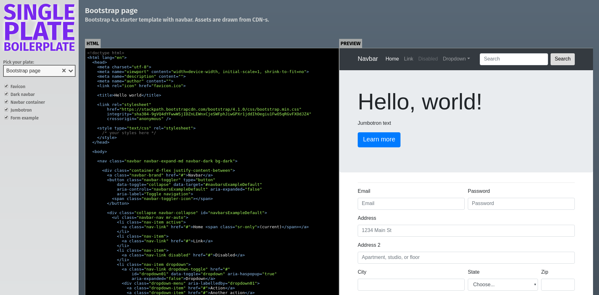

# Single plate boilerplate

All your boilerplate, in a single plate.

http://spb.pantas.net/



Single page app with various boilerplates available for easy copy & paste.
The codebase is plan vue.js. Boilerplates are based on ES6 template strings.
Each boilerplate can specify configuration options.

### Development

```bash
npm install
npm run serve
```

Boilerplates are available as loose files inside `src/boilerplates`.
They are auto-loaded during build.

See `express.js` for an example of what a boilerplate can export.

### License

MIT
